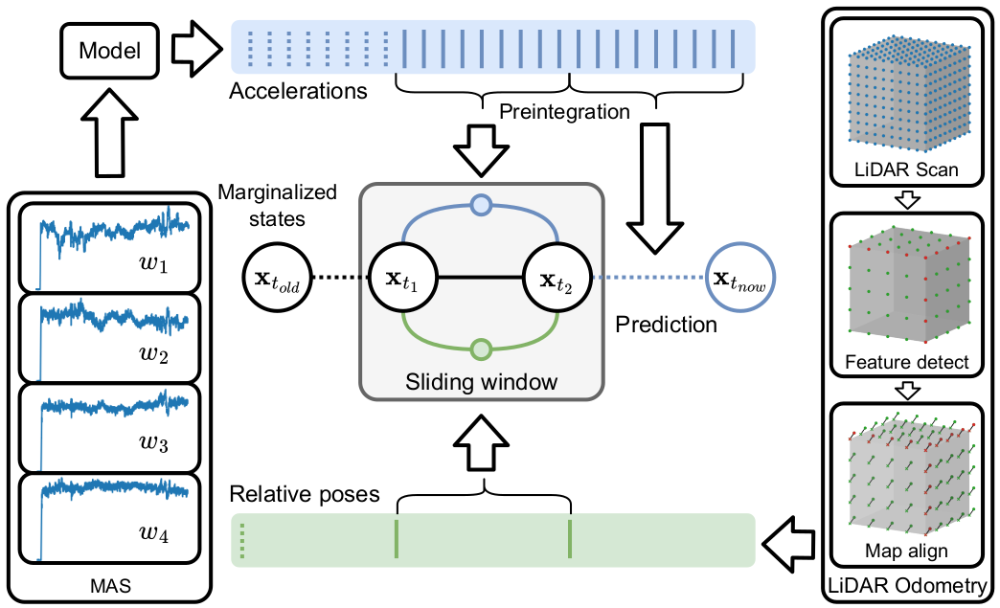

# Motor Angular Speeds (MAS) Factor

This repository contains the public open-source implementation of the Motor Angular Speeds (MAS) factor proposed in our T-RO publication [1].
The implementation is developed for ROS1 Noetic and Ubuntu 20.04 and depends on the [GTSAM](https://github.com/borglab/gtsam) factor graph optimization framework.
The MAS factor can be used instead of the noisy IMU factor when running onboard UAVs and measurements of MAS are available e.g. from ESCs.
The factor can be included in any state estimation/odometry/localization/SLAM algorithm that is build in the GTSAM framework.

*If you use our work please cite our publication [1].*



## Publication

- [1] Petrlik, M.; Penicka, R.; Saska, M. *Motor Angular Speed Preintegration for Multirotor UAV State Estimation*, IEEE Transactions on Robotics (in review), 2024
```bibtex
@article{petrlik2024maslo,
  author={M. Petrlik and Penicka, Robert and Saska, Martin}, 
  journal={IEEE Transactions on Robotics}, 
  title={{Motor Angular Speed Preintegration for Multirotor UAV State Estimation}}, 
  year={2024},
  annotation = {in review}
}
```
 
## MAS Preintegration

The Motor Angular Speed (MAS) measurements of all motors are propagated through the UAV propulsion model, which converts MAS measurements of individual motors into linear and angular accelerations of the Center of Gravity (CoG) of the UAV where the Flight Control Unit (FCU) is ideally located. 
The propulsion model depends on the number of rotors, their position relative to the CoG, and spin direction. 
The model converts MAS measurements into forces and torques acting on the CoG using the thrust and torque coefficients.
With known UAV mass and inertial matrix, the resultant force and torque are converted into linear and angular accelerations, respectively.

Using the raw accelerations directly in the graph optimization would be too computationally demanding, as they are obtained at the same rate as the Electronic Speed Controllers (ESCs) report Revolutions per Minute (RPM) of the motors, which is a few hundred times per second.
To allow lower-rate on-demand fusion of the obtained accelerations while preserving all available information, we employ preintegration of the MAS measurements to obtain delta values of the UAV state.

## Example 

The MAS factor is included in the LiDAR-based MAS-LO state estimation algorithm, which is also proposed in [1].
Please see the [MAS-LO repository](https://github.com/ctu-mrs/maslo) to run an example.

## Acknowledgements

- The preintegration is based the following work
```bibtex
@article{forster2016manifold,
  title={{On-manifold preintegration for real-time visual--inertial odometry}},
  author={Forster, Christian and Carlone, Luca and Dellaert, Frank and Scaramuzza, Davide},
  journal={IEEE Transactions on Robotics},
  volume={33},
  number={1},
  pages={1--21},
  year={2016},
  publisher={IEEE}
}
```


